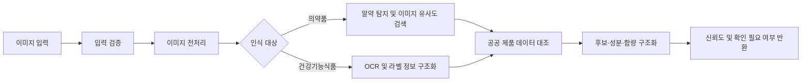
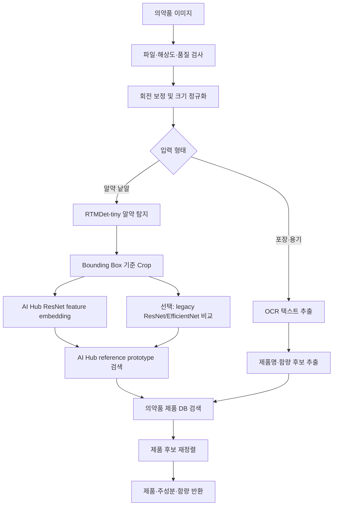
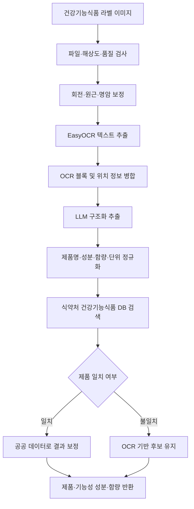

# CLICK AI Recognition

CLICK 서비스에서 사용하는 **의약품 인식**과 **건강기능식품 인식** 파이프라인을 개발하는 저장소입니다.

이 저장소의 책임은 이미지에서 제품 후보와 성분 정보를 추출해 구조화된 인식 결과를 만드는 것까지입니다. 성분 간 상호작용 판정, 위험도 결정, 사용자용 설명 생성은 이 저장소의 범위에 포함하지 않습니다.

## 디렉터리 구조

```text
ai/
├── .venv/                    # 저장소 전용 Python 3.11 환경, Git 제외
├── datasets/                 # 로컬 학습·평가 데이터, 내용 Git 제외
├── training/                 # 학습 설정과 데이터 변환·평가 스크립트
├── requirements/             # 런타임·학습 의존성
├── inference/                # 학습과 분리된 추론 서비스
│   ├── artifacts/            # 추론 모델 가중치, Git 제외
│   ├── aihub_official_code/  # AI Hub 공식 배포 파일, Git 제외
│   ├── outputs/              # 추론 결과, Git 제외
│   ├── pill_recognition/     # v2: RTMDet + AI Hub ResNet retrieval
│   ├── pill_recognition_legacy/ # v1: RTMDet + ResNet/EfficientNet baseline 보존
│   └── supplement_recognition/
└── README.md
```

학습 데이터의 구체적인 배치 규칙은 [`datasets/README.md`](./datasets/README.md), RTMDet 단일 클래스 학습 흐름은 [`training/rtmdet_single_class/README.md`](./training/rtmdet_single_class/README.md)를 따릅니다.

## 현재 구현 상태

`pill-baseline` 브랜치의 기본 의약품 인식 런타임은 v2 retrieval 구조입니다.

- 한 이미지에서 여러 알약을 `pill` 단일 클래스로 탐지
- RTMDet Bounding Box 기준으로 알약별 crop 생성
- AI Hub 공식 ResNet152의 fc 직전 feature로 crop embedding 생성
- AI Hub 1,000종 reference prototype embedding과 cosine similarity 검색
- 결과는 제품명, 성분, 업체, 품목기준코드, 일반/전문 여부와 함께 반환
- Gradio 데모와 FastAPI `/recognize` endpoint 제공
- Gemini는 기본 경로에서 제외하고, 비교/실험용 provider로만 유지

기존 v1 baseline은 `inference/pill_recognition_legacy/`에 보존되어 있습니다.

실행 방법과 환경 구성은 [`inference/pill_recognition/README.md`](./inference/pill_recognition/README.md)를 참고합니다.

```bash
cd /home/gyuha_lee/pill/code/ai/inference
source ../.venv/bin/activate
python -m pill_recognition.app
```

## 공통 처리 흐름



두 파이프라인은 다음 원칙을 공유합니다.

- 인식 결과를 확정 사실이 아닌 **후보와 신뢰도**로 반환합니다.
- 원본 이미지와 중간 인식 결과를 추적할 수 있어야 합니다.
- 신뢰도가 낮거나 여러 제품이 유사하면 `low_confidence`, `ambiguous`, `needs_confirmation` 상태를 구분합니다.
- 인식 실패 시에도 사용자가 제품과 성분을 직접 입력할 수 있도록 실패 원인을 구분합니다.
- 제품명과 성분명은 식품의약품안전처 등 공공 데이터와 대조합니다.

## 의약품 인식 파이프라인

위치: [`inference/pill_recognition/`](./inference/pill_recognition/)

### 입력

- 알약 낱알 사진
- 의약품 포장 또는 용기 사진
- 선택 입력: 알약 앞·뒷면, 각인, 색상, 모양

### 처리 단계



### 모델 및 데이터

| 구분 | 용도 |
|---|---|
| RTMDet-tiny 단일 클래스 | 제품 종류와 무관하게 이미지 내 알약 위치 탐지 및 Bounding Box 생성 |
| AI Hub ResNet152 retrieval | 잘린 알약 이미지와 AI Hub reference prototype 간 이미지 유사도 검색 |
| AI Hub 제품 DB | K-ID, 제품명, 성분, 업체, 외형 정보 매핑 |
| Metadata rerank | 실제 사진 A/B 실험용 색상·형상 후보 재정렬. 기본값 off |
| DINOv2 retrieval | 비교 실험용 foundation embedding. 1000종 평가에서 AI Hub ResNet보다 낮아 기본값 제외 |
| End-to-end evaluator | 합성 multi-pill scene에서 detector F1과 제품 Top-K를 함께 평가 |
| Real smartphone evaluator | 실제 촬영 이미지와 bbox/K-ID annotation으로 서비스형 end-to-end 지표 산출 |
| AI Hub ResNet152 class01 | legacy baseline의 1,000종 K-ID Top-3 분류 |
| EfficientNet-B0 | legacy baseline의 118종 후보 비교 |
| OCR | 의약품 포장과 용기의 제품명·함량 추출 |
| AI-Hub 알약 이미지 데이터 | 탐지 및 분류 모델 학습·평가 |
| 식약처 의약품 데이터 | 제품 코드, 제품명, 주성분, 함량 및 외형 정보 대조 |
| 멀티모달 모델 | 실험용 fallback 또는 설명 보조 |

기본 인식 결과는 외부 LLM 호출 없이 로컬 GPU에서 생성합니다. 멀티모달 모델은 속도와 일관성 문제로 기본 경로에서 제외합니다.

### 출력 예시

```json
{
  "request_id": "rec_pill_001",
  "status": "needs_confirmation",
  "input_type": "pill_image",
  "detections": [
    {
      "bbox": [120, 84, 410, 372],
      "candidates": [
        {
          "product_code": "MFDS_PRODUCT_CODE",
          "product_name": "아스피린정 100mg",
          "active_ingredients": [
            {
              "name": "아세틸살리실산",
              "amount": 100,
              "unit": "mg"
            }
          ],
          "confidence": 0.87
        }
      ]
    }
  ],
  "needs_confirmation": true,
  "warnings": []
}
```

## 건강기능식품 인식 파이프라인

위치: [`inference/supplement_recognition/`](./inference/supplement_recognition/)

### 입력

- 건강기능식품 앞면 사진
- 제품 정보 및 원재료가 표시된 뒷면 라벨 사진
- 여러 장으로 구성된 하나의 제품 이미지 묶음

### 처리 단계



### 모델 및 데이터

| 구분 | 용도 |
|---|---|
| EasyOCR | 라벨 이미지의 한글·영문 텍스트 및 위치 추출 |
| LLM | OCR 텍스트에서 제품명, 성분명, 함량 및 단위 구조화 |
| 식약처 건강기능식품 데이터 | 제품 및 기능성 원료 정보 검증 |

LLM에는 OCR 원문과 정해진 출력 스키마만 전달합니다. LLM이 라벨에 없는 성분이나 함량을 추정하지 않도록 필드별 근거 텍스트를 함께 반환하게 합니다.

### 출력 예시

```json
{
  "request_id": "rec_supplement_001",
  "status": "needs_confirmation",
  "product": {
    "product_code": "MFDS_PRODUCT_CODE",
    "product_name": "오메가3",
    "functional_ingredients": [
      {
        "name": "EPA 및 DHA 함유 유지",
        "amount": 1000,
        "unit": "mg",
        "evidence_text": "EPA 및 DHA 함유 유지 1,000 mg"
      }
    ],
    "confidence": 0.82
  },
  "needs_confirmation": true,
  "warnings": []
}
```

## 공통 상태와 오류

### 상태

| 상태 | 의미 |
|---|---|
| `queued` | 인식 요청이 접수됨 |
| `processing` | 모델 또는 OCR이 실행 중임 |
| `needs_confirmation` | 후보가 생성됐으며 사용자 확인이 필요함 |
| `ambiguous` | 후보가 생성됐지만 상위 후보 점수 차이가 작아 비교 확인이 필요함 |
| `low_confidence` | 후보 점수가 낮아 직접 검색 또는 재촬영이 필요함 |
| `no_candidate` | 탐지된 객체에 대해 제품 후보를 생성하지 못함 |
| `completed` | 확인 가능한 구조화 결과가 생성됨 |
| `partial` | 일부 이미지만 인식됨 |
| `failed` | 결과를 생성하지 못함 |

### 오류 코드

| 코드 | 의미 |
|---|---|
| `INVALID_FILE` | 지원하지 않는 파일 형식 또는 크기 |
| `LOW_IMAGE_QUALITY` | 흐림, 반사, 낮은 해상도 등으로 인식 곤란 |
| `NO_PILL_DETECTED` | 이미지에서 알약을 찾지 못함 |
| `OCR_TEXT_NOT_FOUND` | 라벨에서 유효한 텍스트를 찾지 못함 |
| `PRODUCT_NOT_MATCHED` | 공공 데이터에서 일치하는 제품을 찾지 못함 |
| `MODEL_INFERENCE_FAILED` | 모델 실행 중 오류 발생 |

## 파이프라인 경계

이 저장소가 반환하는 최종 데이터는 다음과 같습니다.

- 제품 코드와 제품명 후보
- 의약품 주성분 또는 건강기능식품 기능성 성분
- 함량과 단위
- 인식 신뢰도
- 인식 근거와 경고
- 사용자 확인 필요 여부

다음 기능은 별도 백엔드 영역에서 담당합니다.

- 성분 간 상호작용 규칙 조회
- 위험 수준 결정
- 복약 관련 권장 행동 결정
- 사용자용 최종 결과 화면 데이터 생성
- 분석 결과 기반 후속 질문

## 개발 순서

1. 입력·출력 스키마와 평가 지표를 확정합니다.
2. 샘플 이미지로 의약품 탐지와 건강기능식품 OCR 기준선을 만듭니다.
3. 식약처 제품 데이터 조회 및 후보 매칭을 연결합니다.
4. 신뢰도 기준과 사용자 확인 조건을 정의합니다.
5. 대표 제품 데이터로 정확도와 실패 유형을 평가합니다.
6. 백엔드가 호출할 수 있는 공통 추론 인터페이스를 제공합니다.
