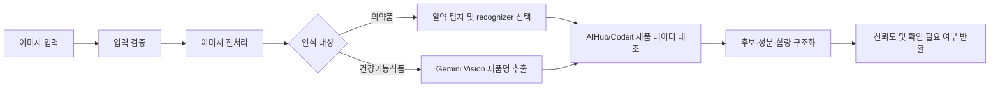

# CLICK AI Recognition

CLICK 서비스에서 사용하는 **의약품 인식**과 **건강기능식품 인식** 파이프라인을 개발하는 저장소입니다.

이미지에서 제품 후보와 성분 정보를 추출해 구조화된 인식 결과를 만드는 것까지가 이 저장소의 책임입니다.
성분 간 상호작용 판정, 위험도 결정, 사용자용 설명 생성은 `click/backend`에서 담당합니다.

---

## 디렉터리 구조

```
ai/
├── app/                            # FastAPI 서버 (port 8001)
│   ├── main.py
│   ├── core/config.py
│   └── api/v1/
│       ├── supplement.py           # POST /api/v1/supplement/recognize
│       └── pill.py                 # POST /api/v1/pill/recognize
├── pill_recognition/               # 의약품 및 알약 인식 파이프라인
│   ├── datasets/                   # 로컬 학습·평가 데이터, 내용 Git 제외
│   ├── training/                   # 학습 설정과 데이터 변환·평가 스크립트
│   ├── requirements/               # 런타임·학습 의존성
│   └── inference/                  # 학습과 분리된 추론 서비스
│       ├── artifacts/              # 추론 모델 가중치, Git 제외
│       ├── aihub_official_code/    # AI Hub 공식 배포 파일, Git 제외
│       ├── outputs/                # 추론 결과, Git 제외
│       ├── pill_recognition/       # v2: RTMDet + AI Hub ResNet retrieval/classifier
│       └── pill_recognition_legacy/ # v1 baseline 보존
├── supplement_recognition/         # 건강기능식품 라벨 인식 파이프라인
│   ├── src/
│   │   ├── pipeline.py             # 파이프라인 오케스트레이션
│   │   ├── extraction/
│   │   │   ├── llm_extractor.py    # Gemini Vision 제품명 추출 (retry + fallback)
│   │   │   ├── image_preprocessor.py # 이미지 전처리 (crop/denoise/enhance)
│   │   │   └── ingredient_parser.py  # 성분명 파싱 (main_fnctn / base_standard)
│   │   ├── matching/
│   │   │   ├── mfds_client.py      # MySQL FULLTEXT + RapidFuzz 매칭
│   │   │   └── matcher.py          # 매칭 결과 + 성분 파싱 결합
│   │   └── schema/result.py        # 응답 스키마 (Pydantic)
│   ├── scripts/
│   │   ├── evaluate_accuracy.py    # 정확도 측정 (이미지 파일명 = 정답)
│   │   ├── search_db.py            # DB 대화형 검색
│   │   ├── test_pipeline.py        # 단일 이미지 파이프라인 테스트
│   │   └── fetch_mfds_data.py      # MFDS 데이터 수집
│   ├── db/init.sql                 # DB 초기화 스크립트
│   ├── data/                       # Git 제외 (테스트 이미지 등)
│   │   ├── samples/                # 정확도 측정용 테스트 이미지
│   │   └── mfds_cache/             # MFDS 캐시
│   └── PIPELINE.md                 # 파이프라인 상세 문서
├── docker-compose.yml
├── requirements.txt
└── README.md
```

학습 데이터의 구체적인 배치 규칙은 [`pill_recognition/datasets/README.md`](./pill_recognition/datasets/README.md), RTMDet 단일 클래스 학습 흐름은 [`pill_recognition/training/rtmdet_single_class/README.md`](./pill_recognition/training/rtmdet_single_class/README.md)를 따릅니다.

---

## 공통 처리 흐름



공통 원칙:
- 인식 결과를 확정 사실이 아닌 **후보와 신뢰도**로 반환합니다.
- 신뢰도가 낮거나 여러 제품이 유사하면 `low_confidence`, `ambiguous`, `needs_confirmation` 상태를 구분합니다.
- 인식 실패 시에도 사용자가 제품과 성분을 직접 입력할 수 있도록 실패 원인을 구분합니다.

---

## 의약품 파이프라인

위치: [`pill_recognition/inference/pill_recognition/`](./pill_recognition/inference/pill_recognition/)

실행 방법과 환경 구성은 [`pill_recognition/inference/pill_recognition/README.md`](./pill_recognition/inference/pill_recognition/README.md)를 참고합니다.

### 현재 구현 상태 (v2)

- 한 이미지에서 여러 알약을 `pill` 단일 클래스로 탐지
- RTMDet Bounding Box 기준으로 알약별 crop 생성
- 요청 또는 환경변수로 인식 엔진 선택
  - `retrieval`: RTMDet + AIHub ResNet152 feature retrieval
  - `aihub_classifier`: RTMDet + AIHub 공식 1,000-class classifier
  - `codeit`: `ZerofZero/codeit10_pj1` 기반 RTMDet + EfficientNet classifier
- retrieval/classifier 후보는 색상·모양·제형 metadata로 재정렬 가능
- 결과는 제품명, 성분, 업체, 품목기준코드, 일반/전문 여부와 함께 반환
- FastAPI `/recognize`, `/crops/recognize`, `/crops/recognize-batch` endpoint 제공
- 독립 pill API는 multipart form field `recognizer=codeit|retrieval|aihub_classifier`로 요청별 엔진 선택 가능

```bash
cd pill_recognition/inference
source ../../.venv/bin/activate
python -m pill_recognition.api --host 0.0.0.0 --port 8001
```

---

## 건강기능식품 파이프라인

자세한 내용 → [`supplement_recognition/PIPELINE.md`](./supplement_recognition/PIPELINE.md)

### 처리 흐름

```
이미지 입력
  ↓
[이미지 전처리]  image_preprocessor.py
  auto-crop / 512~1024px 정규화 / GaussianBlur 노이즈 제거 / 대비·선명도 강화
  ↓
[Gemini Vision]  llm_extractor.py
  1순위: 충북대 AI Gateway (gemini-3.5-flash, CBNUAI_API_KEY)
  2순위: Google Gemini API (gemini-2.0-flash, GEMINI_API_KEY)  ← 자동 fallback
  최대 2회 재시도 (지수 백오프)
  ↓
[MFDS DB 매칭]  mfds_client.py
  MySQL FULLTEXT (ngram) 상위 후보 → RapidFuzz + 길이 패널티 재랭킹
  FULLTEXT 실패 시 LIKE/RapidFuzz fallback
  유사도 70% 미만이면 needs_confirmation 반환
  ↓
[성분 파싱]  ingredient_parser.py
  main_fnctn: [성분명] 브래킷 패턴 추출
  base_standard: 비성분 키워드 필터링 후 콜론 앞 성분명 추출
  복합 성분(의 합), 영문 약어(DHA/EPA) 처리
  ↓
[공식 이미지 보강]  enrichment/official_image_lookup.py
  MFDS/공식 원문에 있는 제품 이미지 URL을 함께 반환
  ↓
SupplementRecognitionResult 반환
  { status, product: { product_name, ingredients: [...], confidence }, needs_confirmation }
```

### 현재 정확도 (테스트 이미지 20장 기준)

| 지표 | 결과 |
|---|---|
| Gemini 추출 성공률 | 20/20 = 100% |
| Gemini 제품명 유사도 | 95.2% |
| DB 정확 매칭률 | 14/20 = 70% |

### API

```
POST /api/v1/supplement/recognize
Content-Type: multipart/form-data
Body: image (JPG/PNG)

Response:
{
  "request_id": "rec_supplement_xxxx",
  "status": "completed",
  "product": {
    "product_code": "20230001234567",
    "product_name": "센트룸 실버 맨",
    "manufacturer": "...",
    "product_image_url": "https://...",
    "product_image_source_url": "https://...",
    "ingredients": ["비타민A", "비타민C", "아연", ...],
    "confidence": 0.97
  },
  "needs_confirmation": false
}
```

### 서버 실행

환경 변수 설정 (`.env`):
```env
CBNUAI_API_KEY=           # 충북대 AI Gateway API 키 (1순위)
GEMINI_API_KEY=           # Google Gemini API 키 (fallback용)
MYSQL_HOST=localhost
MYSQL_PORT=3306
MYSQL_DATABASE=click_db
MYSQL_USER=click_user
MYSQL_PASSWORD=
```

```bash
docker compose up -d
uvicorn app.main:app --reload --port 8002
```

- Swagger: `http://localhost:8002/docs`
- 헬스체크: `http://localhost:8002/health`

---

## 공통 상태 코드

| 상태 | 의미 |
|---|---|
| `queued` | 인식 요청이 접수됨 |
| `processing` | 모델 또는 OCR이 실행 중임 |
| `completed` | 확인 가능한 구조화 결과가 생성됨 |
| `needs_confirmation` | 후보가 생성됐으며 사용자 확인이 필요함 |
| `ambiguous` | 상위 후보 점수 차이가 작아 비교 확인이 필요함 |
| `low_confidence` | 후보 점수가 낮아 직접 검색 또는 재촬영이 필요함 |
| `no_candidate` | 제품 후보를 생성하지 못함 |
| `partial` | 일부 이미지만 인식됨 |
| `failed` | 결과를 생성하지 못함 |

### 건강기능식품 오류 코드

| 오류 코드 | 의미 |
|---|---|
| `INVALID_FILE` | JPG/PNG 외 파일 형식 |
| `OCR_TEXT_NOT_FOUND` | Gemini가 제품명을 추출하지 못함 |
| `PRODUCT_NOT_MATCHED` | MFDS DB에서 일치 제품 없음 |
| `MODEL_INFERENCE_FAILED` | Gemini API 호출 실패 |

---

## 남은 작업

- [x] Backend 다중 성분 엔드포인트 연동 (`ingredients` 리스트 → `/api/v1/interactions/analyze`)
- [x] 제품 공식 이미지 URL 응답
- [x] 알약 인식 엔진 요청별 선택
- [ ] 실제 이미지 정확도 테스트 확대
- [ ] `supplement_recognition/src/ocr/reader.py` 제거 (EasyOCR 잔재, 미사용)
