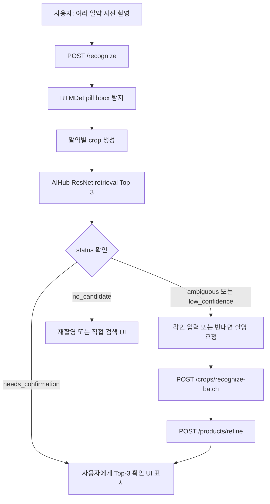

# Pill Recognition Service Flow

이 문서는 CLICK 앱이 알약 묶음 사진을 인식할 때 따라야 하는 서비스 호출 흐름입니다. 기본 원칙은 제품을 단정하지 않고 Top-3 후보와 확인 상태를 반환하는 것입니다.

## 기본 흐름



## Endpoint Responsibilities

| Endpoint | 책임 | detector 사용 | 주 사용처 |
|---|---|---:|---|
| `POST /recognize` | 원본 사진에서 여러 알약 탐지 및 제품 후보 Top-3 반환 | 예 | 최초 촬영 |
| `POST /crops/recognize` | 선택된 알약 crop 1개를 제품 후보 Top-3로 재확인 | 아니오 | 단일 반대면 crop 확인 |
| `POST /crops/recognize-batch` | 여러 crop을 한 번의 batch로 재확인 | 아니오 | 앞/뒷면 또는 여러 선택 알약 재확인 |
| `GET /products/search` | 각인, 색, 모양, 제품명, 성분으로 AIHub DB 검색 | 아니오 | 직접 검색 UI, OCR/수기 입력 |
| `POST /products/refine` | 이미지 후보와 각인/색/모양/텍스트 근거를 합쳐 재정렬 | 아니오 | 후보 확정 전 최종 보정 |
| `GET /health` | 서버 정책과 상태 확인 | 아니오 | 앱 초기화, 운영 모니터링 |

## Status Contract

| Status | 의미 | 앱 권장 액션 |
|---|---|---|
| `needs_confirmation` | 후보가 충분히 나왔지만 최종 복용 전 사용자 확인 필요 | Top-3 제품명, 성분, 외형 정보 표시 후 사용자 선택 |
| `ambiguous` | 1위와 2위 점수 차이가 작음 | 각인 입력, 반대면 촬영, 또는 포장/처방전 확인 요청 |
| `low_confidence` | 최고 후보 점수가 낮음 | 가까이서 재촬영하거나 반대면 crop 요청 |
| `no_candidate` | 후보를 만들지 못함 | 재촬영 또는 수동 검색 UI로 이동 |

모든 status는 최종 복용 전 사용자 확인이 필요하다는 전제를 유지합니다.

## Recommended App Sequence

1. 사용자가 한 장에 여러 알약을 겹치지 않게 놓고 촬영합니다.
2. 앱은 원본 이미지를 `POST /recognize`로 보냅니다.
3. 응답의 `detections`를 화면에 bbox 또는 번호로 표시합니다.
4. 응답의 `warnings`에 촬영 품질 문제가 있으면 먼저 재촬영 안내를 표시합니다.
5. 각 detection마다 `candidates[0:3]`, `ingredient`, `print_front`, `print_back`, `drug_shape`, `color_class1`, `color_class2`, `status`를 보여줍니다.
6. `needs_confirmation`이면 사용자가 후보 중 하나를 선택하게 합니다.
7. `ambiguous` 또는 `low_confidence`이면 다음 중 하나를 요청합니다.
   - 알약 앞/뒷면 각인 입력
   - 선택된 알약의 반대면 crop 추가 촬영
   - 더 가까운 재촬영
8. 추가 crop이 있으면 `POST /crops/recognize-batch`로 한 번에 보냅니다.
9. 최초 후보와 추가 crop 후보를 합쳐 `POST /products/refine`으로 보냅니다.
10. refine 응답의 `status`를 다시 확인하고 사용자 확인 UI를 갱신합니다.

## Candidate Refinement Payload

`/products/refine`의 `candidates`에는 `/recognize` 또는 `/crops/recognize-batch`에서 받은 후보를 그대로 넣을 수 있습니다. 앞/뒷면 구분이 있으면 `view`를 채웁니다.

```json
{
  "candidates": [
    {
      "pill_id": "K-001732",
      "score": 55.0,
      "source": "aihub_resnet_retrieval",
      "view": "front"
    },
    {
      "pill_id": "K-001732",
      "score": 76.0,
      "source": "aihub_resnet_retrieval",
      "view": "back"
    },
    {
      "pill_id": "K-012914",
      "score": 92.0,
      "source": "aihub_resnet_retrieval",
      "view": "front"
    }
  ],
  "imprint": "W2",
  "shape": "원형",
  "color": "하양",
  "limit": 3
}
```

같은 `pill_id`가 여러 crop에서 반복되면 `image_evidence_count`와 `views`가 응답에 포함되며, 작은 multi-view 보너스가 적용됩니다.

## Operational Limits

| 항목 | 기본값 | 설정 |
|---|---:|---|
| 제품 후보 수 | 3 | `PILL_TOP_K` |
| batch crop 최대 개수 | 12 | `PILL_MAX_BATCH_CROPS` |
| 이미지 1장 최대 크기 | 10MB | `PILL_MAX_UPLOAD_BYTES` |
| 이미지 1장 최대 픽셀 수 | 12MP | `PILL_MAX_IMAGE_PIXELS` |
| 후보 최소 점수 | 70 | `PILL_CANDIDATE_MIN_SCORE` |
| 모호성 margin | 3 | `PILL_CANDIDATE_AMBIGUITY_MARGIN` |
| retrieval query 전처리 | `none` | `PILL_RETRIEVAL_QUERY_PREPROCESS` |

`GET /health`는 현재 `recognizer`, `top_k`, `max_batch_crops`, `max_upload_bytes`, `max_image_pixels`, `retrieval_query_preprocess`를 반환합니다. 프론트는 앱 시작 시 이 값을 읽어 업로드 UI 제한과 촬영 후 리사이즈 정책에 반영할 수 있습니다.

## Capture Quality Warnings

`RecognitionResult.warnings`는 모델 후보와 별도로 촬영 품질 문제를 알려줍니다. 현재 서버는 다음 입력을 경고합니다.

- 해상도가 너무 낮은 원본 이미지 또는 crop
- 너무 어두운 이미지
- 과노출 또는 반사가 심한 이미지
- 대비가 낮아 알약 경계가 약한 이미지
- 흐리거나 흔들린 이미지

프론트는 `warnings`가 비어 있지 않으면 Top-3 후보를 보여주더라도 “확정” 흐름으로 바로 보내지 말고, 같은 화면에서 재촬영 또는 해당 crop 재촬영을 우선 제안해야 합니다.

## UX Notes

- 알약끼리 붙거나 겹치면 bbox가 합쳐질 수 있으므로 촬영 가이드에서 간격을 요구합니다.
- 흰색 원형정처럼 비슷한 제품이 많은 경우 각인 입력 또는 반대면 촬영을 우선 요청합니다.
- 후보가 좋아 보여도 단일 후보만 표시하지 말고 항상 Top-3와 성분을 함께 보여줍니다.
- `ingredient`가 `|`로 구분된 복합 성분이면 프론트에서 쉼표로 나눠 표시합니다.
- API 응답의 `timings_ms.total`은 사용자 체감 latency, `timings_ms.detector`와 `timings_ms.recognition`은 백엔드 병목 판단 지표로 로깅합니다.
- 실제 스마트폰 검증셋 평가는 `analysis.recognition_top3_misses`, `analysis.detector_misses`, `analysis.warning_images`를 우선 확인해 모델 문제와 촬영 문제를 분리합니다.
- 본 파이프라인은 제품 후보 제공까지 담당하며, 복약 가능 여부나 상호작용 판정은 별도 서비스에서 처리합니다.
